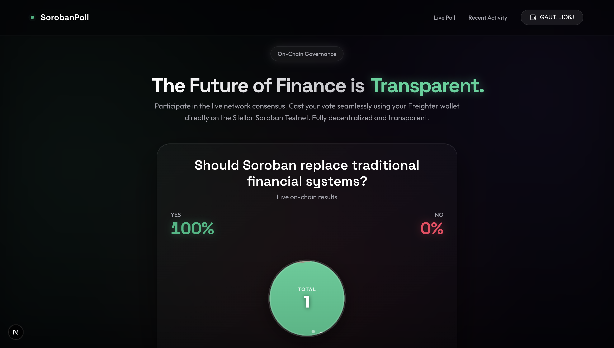
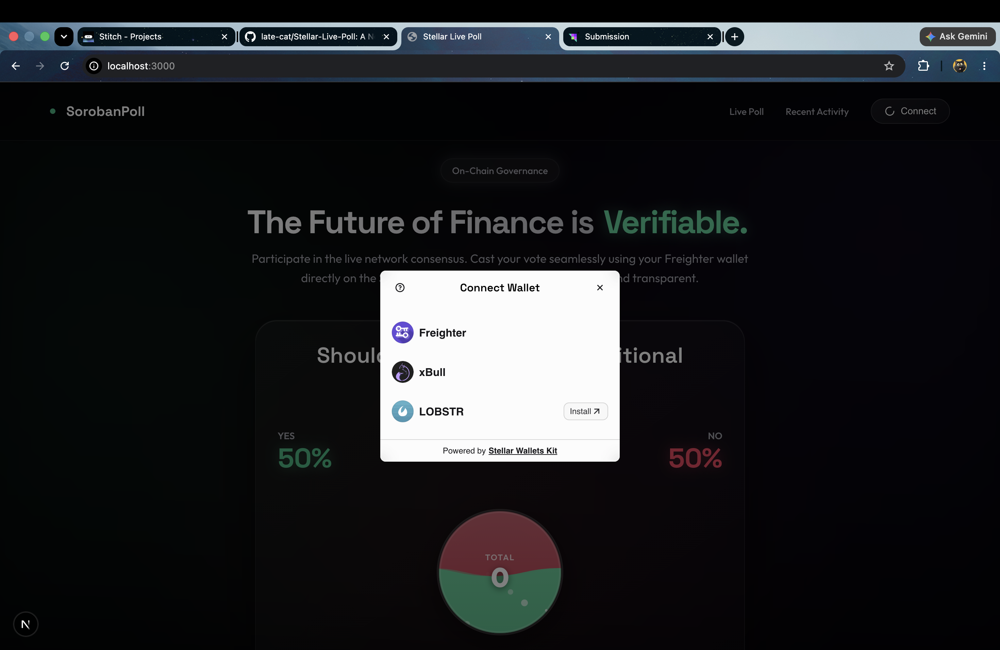
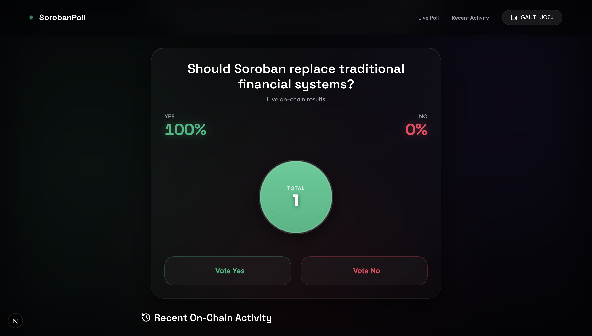
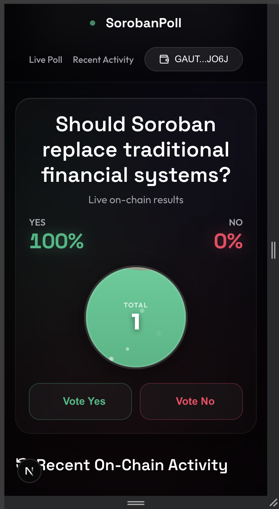
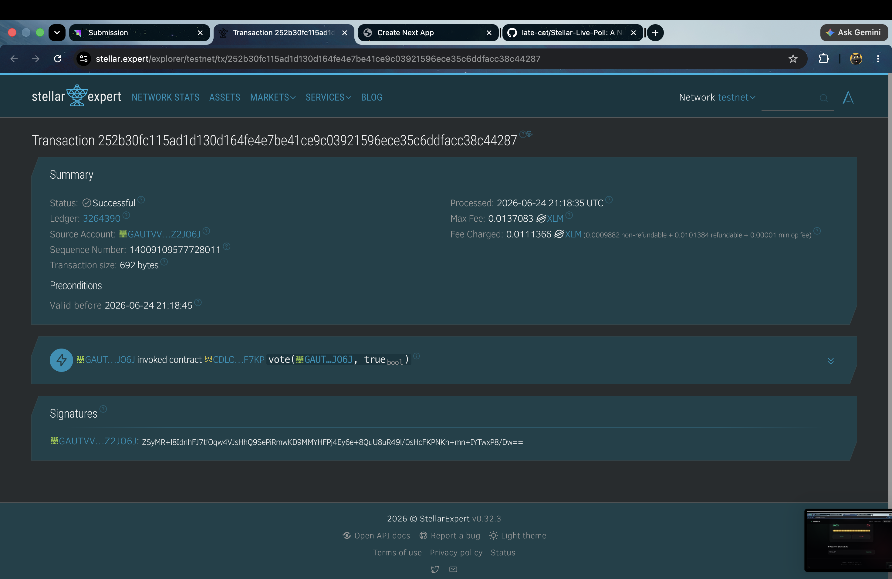

  
  
  <h1 align="center">Stellar Live Poll</h1>
  
  

    <strong>A decentralized real-time polling application powered by Soroban Smart Contracts.</strong>
  

  

    <a href="https://stellar-live-poll-six.vercel.app/"><strong>Live Demo</strong></a>  
    <a href="#challenge-requirements-fulfilled">White Belt Challenge Submission</a> •
    <a href="#smart-contract-information">View Contract</a> •
    <a href="#local-setup-instructions">Get Started</a>
  

---

## Project Description

Stellar Live Poll is a modern, decentralized real-time polling application built to demonstrate the capabilities of the Stellar network. By combining Next.js with a Soroban Smart Contract deployed on the Stellar Testnet, users can seamlessly connect their Freighter wallets, cast immutable votes on-chain, and watch poll results update automatically in real time with fluid animations.

## Key Features

- **Multi-wallet Integration:** Securely connect and manage sessions using `@creit.tech/stellar-wallets-kit`.
- **On-chain Voting:** Votes are cast directly on the Stellar Testnet via a custom Soroban smart contract.
- **Real-time Synchronization:** Poll results are instantly fetched and rendered, providing immediate feedback.
- **Premium UX/UI:** Fluid result visualization and micro-interactions powered by Framer Motion and Tailwind CSS.
- **Transaction Flow:** End-to-end transparent transaction signing, submission, and confirmation.

## Level 2 Challenge Submission Checklist

This project serves as a comprehensive submission for the Stellar Level 2 White Belt challenge, fulfilling all core criteria:

- [x] **3 error types handled:** The smart contract throws and the UI gracefully decodes `AlreadyVoted`, `PollClosed`, and `InvalidOption`.
- [x] **Contract deployed on testnet:** Custom Soroban contract deployed to Testnet (see below).
- [x] **Contract called from the frontend:** The Next.js frontend calls `vote` and `get_results` natively using Soroban SDK.
- [x] **Transaction status visible:** Animated toasts and activity feeds display on-chain success, pending states, or failure.
- [x] **Minimum 2+ meaningful commits:** 10+ professional, atomic commits executed.
- [x] **Multi-wallet app:** Connected via Stellar Wallets Kit (Freighter, xBull, Lobstr natively supported).

## Required Links & Information

- **Live Demo Link:** [Stellar Live Poll Vercel Deployment](https://stellar-live-poll-six.vercel.app/)
- **Screenshot of Wallet Options:**  *(Note: Wallet selector supports Freighter, xBull, and Lobstr)*
- **Deployed Contract Address:** `CBBKRRX4JUV2WABG43LIBU77ZXSZ5D3RXLPXUJA4M3LQM7K2XLMOHWMJ`
- **Transaction Hash:** [`386bd2d2f1b0e64329d8b1275f8bdc963c37719cb0767615801e7996ba2c4155`](https://stellar.expert/explorer/testnet/tx/386bd2d2f1b0e64329d8b1275f8bdc963c37719cb0767615801e7996ba2c4155)

## Visual Walkthrough

### The Polling Interface

### Mobile Optimized View

### On-Chain Transaction Success

