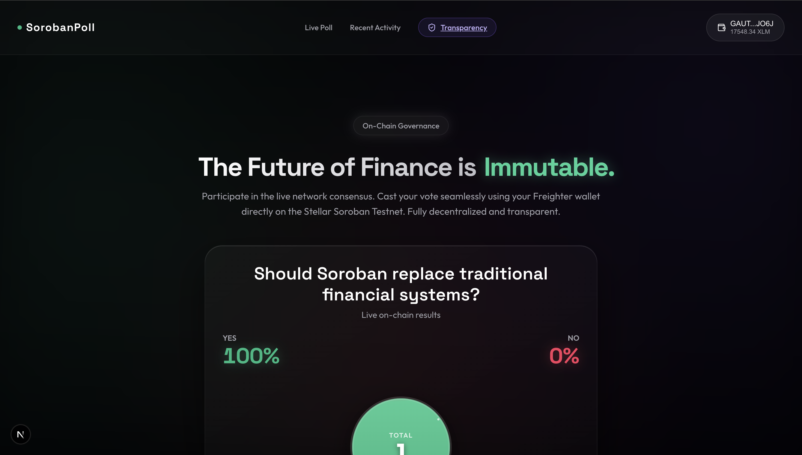
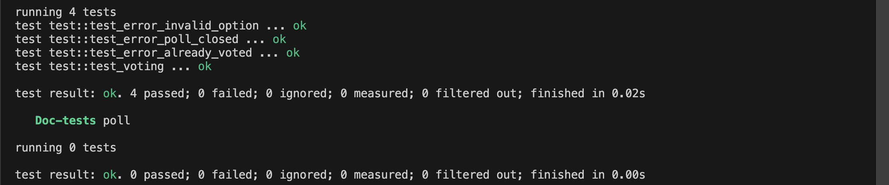
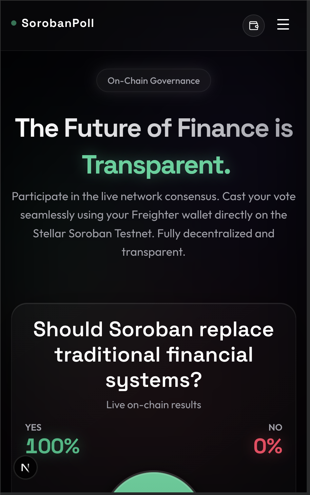
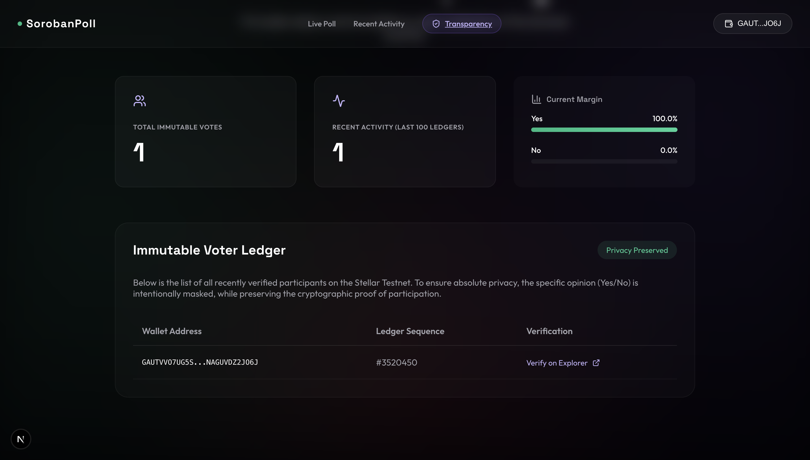
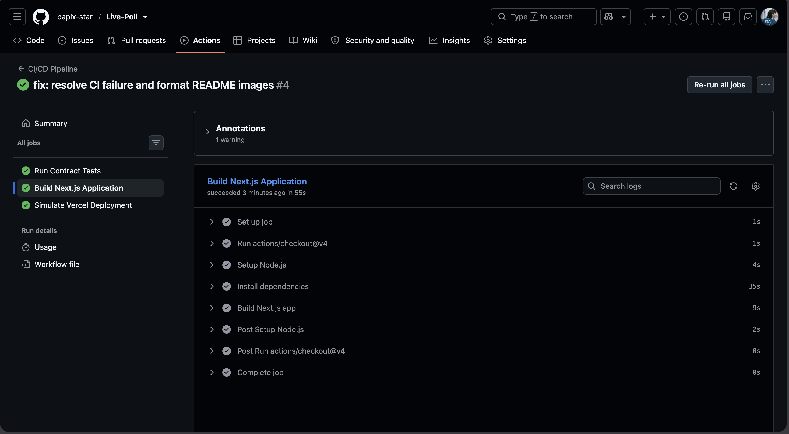
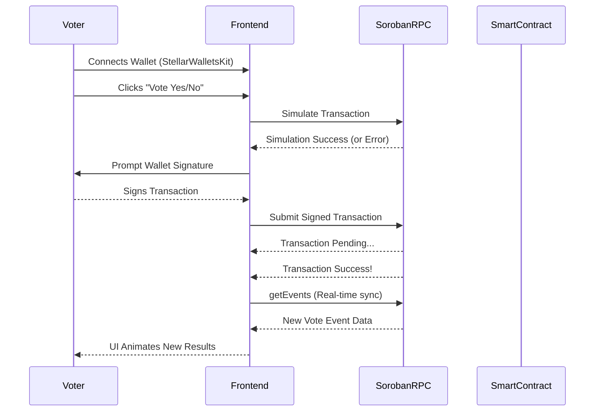

<div align="center">
  
  
  <h1 align="center">Stellar Live Poll</h1>
  
  <p align="center">
    <strong>A decentralized real-time polling application powered by Soroban Smart Contracts.</strong>
  </p>

  <p align="center">
    <a href="https://stellar-live-poll-six.vercel.app/"><strong>Live Demo</strong></a><br><br>
    <a href="#-core-challenge-requirements-highlighted">Level 2 (Yellow Belt) Submission</a> •
    <a href="#-smart-contract-architecture">View Contract</a> •
    <a href="#-local-setup--deployment">Get Started</a>
  </p>
</div>

---

## 📖 Project Overview

Stellar Live Poll is a modern, decentralized real-time polling application built to demonstrate the powerful capabilities of the Stellar network. By combining Next.js with a Soroban Smart Contract deployed on the Stellar Testnet, users can seamlessly connect multiple wallets, cast immutable votes on-chain, and watch poll results update automatically via real-time event synchronization.

---

## 🏆 Core Challenge Requirements (Highlighted)

This project was built explicitly to fulfill the **Stellar Level 2 (Yellow Belt)** requirements. Below is the breakdown of how each core requirement is successfully implemented:

### 1. Multi-Wallet Integration
- **Implementation:** The platform integrates `@creit.tech/stellar-wallets-kit`, enabling a unified login experience.
- **Support:** Users can connect securely using **Freighter**, **xBull**, or **Lobstr** wallets.

### 2. Deep Error Handling (3 Specific Types)
The application has been engineered to handle critical edge cases gracefully during the transaction lifecycle. **Reviewers can verify these directly in the Live Demo:**
- **Wallet Not Found:** 
  - *How to test:* Open the live link in an Incognito/Private window (where Freighter is not installed) and attempt to connect.
  - *Result:* The UI catches the missing extension and displays a toast: `"Wallet not found. Please install Freighter..."`
- **Transaction Rejected:** 
  - *How to test:* Connect a valid wallet, click "Vote Yes", and when the wallet signature pop-up appears, click **Reject**.
  - *Result:* The UI catches the user decline event and displays a toast: `"Transaction was rejected in the wallet."`
- **Insufficient Balance:** 
  - *How to test:* Connect a fresh wallet containing **0 Testnet XLM**, and attempt to cast a vote.
  - *Result:* The UI submits the transaction, intercepts the `tx_insufficient_balance` Horizon error, and displays a toast: `"Insufficient balance to complete the transaction."`

*Additionally, all custom smart contract errors (`AlreadyVoted`, `PollClosed`, `InvalidOption`) are covered by passing local cargo unit tests:*
<div align="center">
  
</div>

### 3. Contract Deployed on Testnet
- **Implementation:** A custom Rust Soroban smart contract has been successfully deployed to the Stellar Testnet.
- **Contract ID:** `CBBKRRX4JUV2WABG43LIBU77ZXSZ5D3RXLPXUJA4M3LQM7K2XLMOHWMJ`
- **Verification:** [View Contract on Stellar Expert Explorer](https://stellar.expert/explorer/testnet/contract/CBBKRRX4JUV2WABG43LIBU77ZXSZ5D3RXLPXUJA4M3LQM7K2XLMOHWMJ)

### 4. Contract Called from the Frontend
- **Implementation:** The Next.js frontend calls smart contract functions (`vote` and `get_results`) natively.
- **Verification:** Transaction submission and XDR encoding are managed via `TransactionBuilder` and the Soroban SDK.
- **Sample Transaction Hash:** [`386bd2d2f1b0e64329d8b1275f8bdc963c37719cb0767615801e7996ba2c4155`](https://stellar.expert/explorer/testnet/tx/386bd2d2f1b0e64329d8b1275f8bdc963c37719cb0767615801e7996ba2c4155)

### 5. Event Listening & State Synchronization
- **Implementation:** The application actively polls the Soroban RPC for recent `VoteEvent`s using `getEvents`.
- **Result:** When the blockchain ledger closes and emits a new event, the UI immediately calculates the new percentage distributions and fluidly animates the progress bars, requiring zero manual page refreshes.

### 6. Transaction Status Tracking
- **Implementation:** End-to-end transparent tracking with animated UI toasts.
- **States Covered:** Users receive real-time notifications for **Pending** (wallet confirming), **Success** (ledger confirmed), and **Failed** (insufficient balance/rejected) states.

---

## 📸 Visual Walkthrough

### 💳 Wallet Options & Connection
*A unified modal powered by StellarWalletsKit allowing connection via Freighter, xBull, or Lobstr.*
<div align="center">
  
</div>

### 🗳️ The Polling Interface
*Users are presented with a clean, animated pie-chart representing the current on-chain vote distribution. Built using Framer Motion.*
<div align="center">
  
</div>

### 📱 Mobile Optimized View
*The layout is fully responsive, featuring a sleek horizontal navbar and hamburger menu, ensuring mobile users can connect their wallets and cast votes seamlessly.*
<div align="center">
  
</div>

### 🔍 Immutable Transparency Dashboard
*A dedicated dashboard providing a complete voter ledger mapped to the Stellar Testnet. It features absolute privacy by masking specific voter choices while retaining on-chain cryptographic verifiability.*
<div align="center">
  
</div>

### 🔗 On-Chain Transaction Success
*Upon voting, transactions are processed and signed through the wallet extension. The success state provides a direct link to the Stellar Testnet Explorer.*
<div align="center">
  
</div>

---

## 🧪 Automated CI/CD & Testing

The project implements a strict CI/CD pipeline via GitHub Actions to ensure maximum production safety:

<div align="center">
  
</div>

*   **Contract Tests**: Local Rust tests (`cargo test`) guarantee robust smart contract logic (e.g., voting bounds, duplication checks, and state storage).
*   **Frontend Build**: The pipeline ensures no regression breaks the Next.js production build process on every push.

---

## ⚙️ Smart Contract Architecture

The application utilizes a robust client-serverless architecture mapping Next.js directly to the Soroban RPC.



---

## 💻 Local Setup & Deployment

To run this application locally, ensure you have Node.js and Rust installed.

### 1. Configure Environment
Create a `.env.local` file in the root directory (you can copy `.env.example`) and configure your contract address:
```env
NEXT_PUBLIC_CONTRACT_ADDRESS=CBBKRRX4JUV2WABG43LIBU77ZXSZ5D3RXLPXUJA4M3LQM7K2XLMOHWMJ
NEXT_PUBLIC_SOROBAN_RPC_URL=https://soroban-testnet.stellar.org
```

### 2. Run the Frontend App
```bash
# Install all dependencies
npm install

# Start the development server
npm run dev
```
Navigate to `http://localhost:3000` to interact with the application.

### 3. Automated Smart Contract Deployment (Optional)
If you wish to compile and deploy your own instance of the smart contract to the Testnet, simply run the included deployment script:
```bash
# Ensure you have the Soroban CLI installed first
chmod +x deploy.sh
./deploy.sh
```
*Note: Update your `.env.local` with the new Contract ID generated after deployment.*


---

## 📄 License

This project is open-source and available under the [MIT License](LICENSE).
