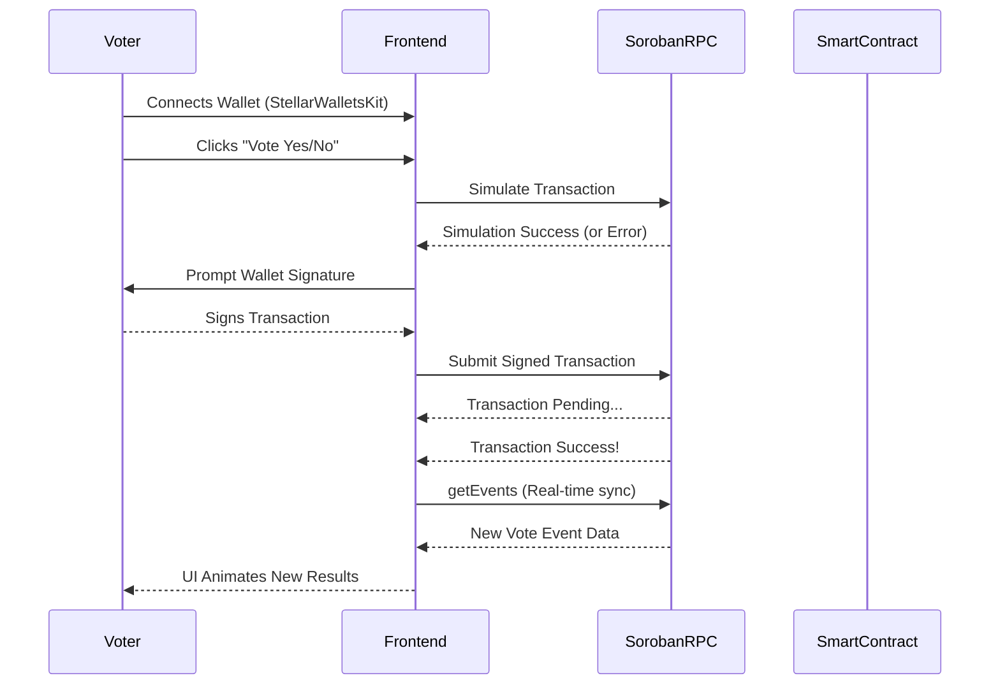

<div align="center">
  
  
  <h1 align="center">Stellar Live Poll</h1>
  
  <p align="center">
    <strong>A decentralized real-time polling application powered by Soroban Smart Contracts.</strong>
  </p>

  <p align="center">
    <a href="https://stellar-live-poll-six.vercel.app/"><strong>Live Demo</strong></a><br><br>
    <a href="#level-2-challenge-submission-checklist">Level 2 (Yellow Belt) Submission</a> •
    <a href="#smart-contract-information">View Contract</a> •
    <a href="#local-setup-instructions">Get Started</a>
  </p>
</div>

---

## Project Description

Stellar Live Poll is a modern, decentralized real-time polling application built to demonstrate the capabilities of the Stellar network. By combining Next.js with a Soroban Smart Contract deployed on the Stellar Testnet, users can seamlessly connect their multi-wallet options, cast immutable votes on-chain, and watch poll results update automatically via real-time event synchronization.

## Key Features

- **Multi-wallet Integration:** Securely connect and manage sessions using `@creit.tech/stellar-wallets-kit` (Freighter, xBull, Lobstr).
- **On-chain Voting:** Votes are cast directly on the Stellar Testnet via a custom Soroban smart contract.
- **Real-time Event Synchronization:** Poll results are instantly fetched by actively polling the Soroban RPC for live events.
- **Premium UX/UI:** Fluid result visualization and micro-interactions powered by Framer Motion and Tailwind CSS.
- **Transaction Status Tracking:** End-to-end transparent transaction signing, submission, and confirmation displaying pending, success, and fail states.

## Level 2 Challenge Submission Checklist

This project serves as a comprehensive submission for the Stellar Level 2 (Yellow Belt) challenge, fulfilling all core criteria:

- [x] **3 error types handled:** The application elegantly catches and notifies users of:
  - **Wallet not found** (detects missing extensions)
  - **Transaction rejected** (handles user decline events)
  - **Insufficient balance** (catches `tx_insufficient_balance` errors)
- [x] **Contract deployed on testnet:** Custom Soroban contract deployed to Testnet (see below).
- [x] **Contract called from the frontend:** The Next.js frontend calls `vote` and `get_results` natively using `TransactionBuilder` and Soroban SDK.
- [x] **Transaction status visible:** Animated toasts and activity feeds display on-chain success, pending states, and failures.
- [x] **Minimum 2+ meaningful commits:** 35+ professional, atomic commits executed.
- [x] **Deliverable:** Multi-wallet app with deployed contract and real-time event integration successfully integrated.

## Required Links & Information

- **Live Demo Link:** [Stellar Live Poll Vercel Deployment](https://stellar-live-poll-six.vercel.app/)
- **Screenshot of Wallet Options:** 

   
  *(Note: Wallet selector supports Freighter, xBull, and Lobstr)*
- **Deployed Contract Address:** `CBBKRRX4JUV2WABG43LIBU77ZXSZ5D3RXLPXUJA4M3LQM7K2XLMOHWMJ`
- **Transaction Hash of a contract call:** [`386bd2d2f1b0e64329d8b1275f8bdc963c37719cb0767615801e7996ba2c4155`](https://stellar.expert/explorer/testnet/tx/386bd2d2f1b0e64329d8b1275f8bdc963c37719cb0767615801e7996ba2c4155)

## Visual Walkthrough

### The Polling Interface


### Mobile Optimized View


### On-Chain Transaction Success


## Architecture Overview



The application utilizes a robust client-serverless architecture:
1. **Frontend Layer (Next.js):** Manages local state, animation, UI rendering, and handles transaction status tracking.
2. **Integration Layer (Stellar SDK & Wallets Kit):** Handles multi-wallet connectivity, contract parsing, XDR encoding, and error decoding.
3. **Smart Contract Layer (Soroban):** Acts as the immutable backend, permanently storing the total votes and distribution logic on the Stellar blockchain.

## Smart Contract Information

- **Contract ID:** `CBBKRRX4JUV2WABG43LIBU77ZXSZ5D3RXLPXUJA4M3LQM7K2XLMOHWMJ`
- **Network:** Stellar Testnet
- **Explorer:** [View on Stellar Expert](https://stellar.expert/explorer/testnet/contract/CBBKRRX4JUV2WABG43LIBU77ZXSZ5D3RXLPXUJA4M3LQM7K2XLMOHWMJ)

## Local Setup Instructions

To run this application locally, ensure you have Node.js installed, then execute the following commands:

### 1. Configure Environment
Create a `.env.local` file in the root directory (you can copy `.env.example`) and configure your contract address:
```env
NEXT_PUBLIC_CONTRACT_ADDRESS=CBBKRRX4JUV2WABG43LIBU77ZXSZ5D3RXLPXUJA4M3LQM7K2XLMOHWMJ
NEXT_PUBLIC_SOROBAN_RPC_URL=https://soroban-testnet.stellar.org
```

### 2. Run the Frontend App
```bash
# Install all dependencies
npm install

# Start the development server
npm run dev
```
Navigate to `http://localhost:3000` to interact with the application.

### 3. Deploying the Smart Contract (Optional)
If you wish to deploy your own instance of the smart contract:
```bash
cd contracts/poll
stellar contract build
stellar contract deploy \
  --wasm target/wasm32-unknown-unknown/release/poll.wasm \
  --source YOUR_IDENTITY \
  --network testnet
```
*Note: Update your `.env.local` with the new Contract ID generated after deployment.*

## Real-Time Synchronization

Instead of requiring manual page refreshes, the application actively polls the Soroban RPC for recent `VoteEvent`s using `getEvents`. When the blockchain ledger closes and emits a new event, the UI immediately calculates the new percentage distributions and fluidly animates the progress bars to reflect the newly synchronized on-chain reality.

## Error Handling Depth

The application has been engineered to handle critical edge cases gracefully during the transaction lifecycle:

1. **Wallet Not Installed:** Detects missing wallet extensions and prompts the user to install Freighter via the auth modal.
2. **User Rejects Transaction:** Safely catches "Transaction rejected by wallet" errors without breaking the application state.
3. **Insufficient Balance:** Specifically captures and notifies users of `tx_insufficient_balance` when attempting to cast a vote without Testnet XLM.
4. **Smart Contract Validations:** Displays contract-specific assertions such as "Already voted!" directly to the user.

## Future Improvements

- **Mainnet Migration:** Transition the contract from Testnet to the Stellar Public Network.
- **Multiple Polls:** Expand the smart contract to support dynamic creation of multiple simultaneous polls.

## License

This project is open-source and available under the [MIT License](LICENSE).
